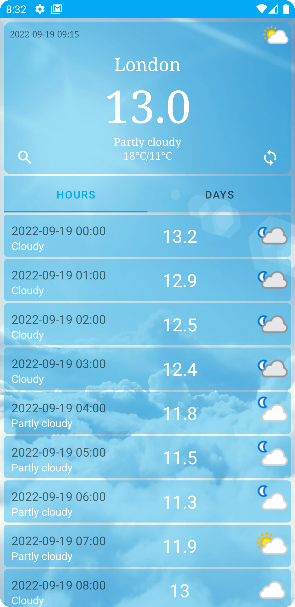

# WeatherApplication
Разработка приложения для отображения погоды. Для получения данных погоды использовал открытое API.

## Возможности приложения
* Возможность вбить место по названию.
* Возможность выбрать место на карте. 
* Избранные местоположения, которые пользователь может сохранять.
* Возможность показать погоду для текущего местоположения.
* Показ погоды на сегодня.

## Технологический стек
* MVVM
* Kotlin Coroutines
* Room
* Retrofit
* AdapterDelegates
* Google Maps SDK
* Viewbinding

## Минимальные требования
* Поддержка Android 5.0+
* Поддержка смартфонов
* Поддержка портретной ориентации
* Приложение должно быть реализовано с рекомендациями Material Design
* targetSdk=30 или выше
* Kotlin

## Приложение находится в разработке, на данный момент реализовано
* Подключено API.
* Создан MainFragment.
* Загрузка прогноза погоды для текущего местоположения.
* Отрисован главный экран
* Созданы фрагменты Hours и Days
* Создан data class и разметка list_item
* Добавлен RecyclerView Adapter
* Парсинг данных полученных с API
* Показ полученной информации на экране
* Показ списка погоды по часам
* Показ списка погоды по дням
* Получение прогноза погоды по местоположению
* Добавлен AlertDialog с выбором города

## Скриншоты
  
  
